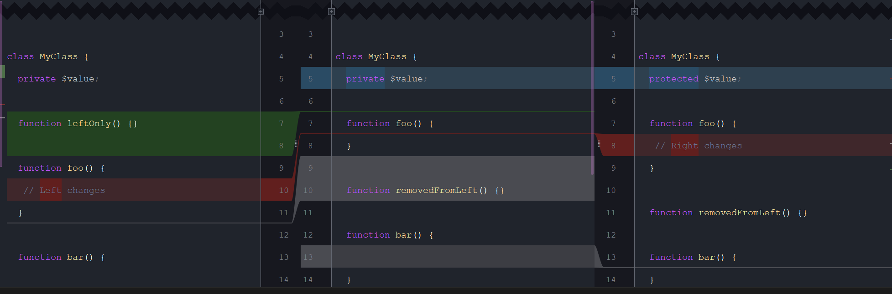
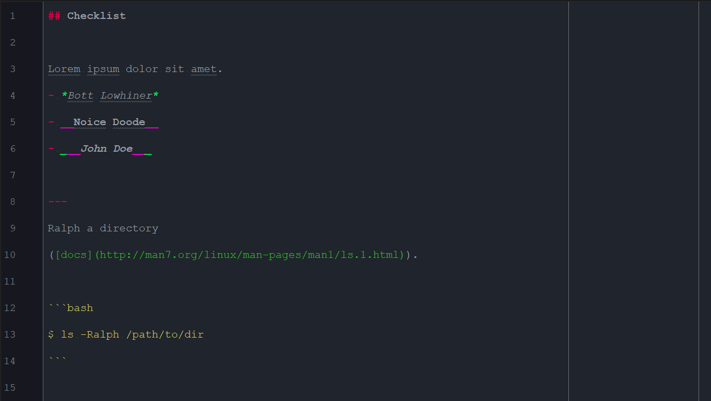
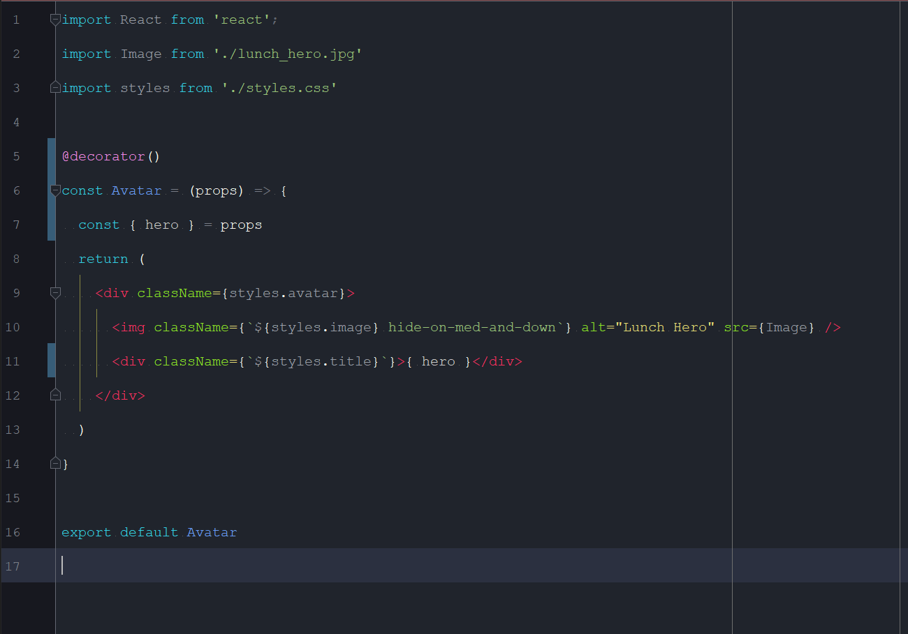
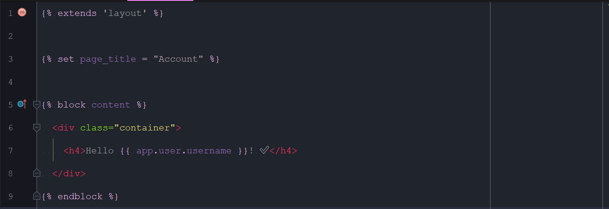
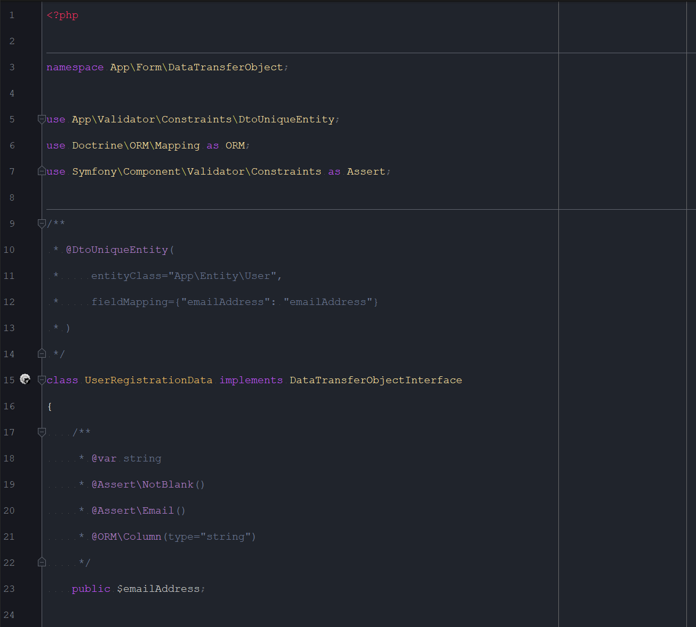

# PHPStormSettings
Code styles, colors, inspections for PhpStorm. ☕

Philosophy: Use best practice where possible.

## Featuring
#### Supported languages

- Git / Diff / Merge |
- Markdown
- HTML / XML
- CSS / SASS / SCSS
- Javascript / ES6+
- JSX / React
- PHP
- Twig
- Blade
- Yaml
- Ini

#### Enforced standards

- Javascript:
[Javascript standard style](https://standardjs.com/)
- PHP:
[PSR](https://www.php-fig.org/psr/) +
[Symfony](https://symfony.com/doc/current/contributing/code/standards.html) +
space around concatenation operator.
- CSS / SASS / SCSS:
[Sass-lint standard](https://www.npmjs.com/package/sass-lint)

#### Custom hotkeys

- Save all: <kbd>Ctrl</kbd> + <kbd>S</kbd>
- Save all + format current file: <kbd>Ctrl</kbd> + <kbd>Alt</kbd> + <kbd>S</kbd>
- Replace in path <kbd>Ctrl</kbd> + <kbd>Shift</kbd> + <kbd>H</kbd>

## Examples

### VCS / Diff / Merge example



### Markdown example



### Javascript / HTML / React example



### Twig example



### PHP example



## Getting started

#### Full Install

- Backup your config folder (if any).
- Clone this repo to __be your new config__ folder;
```bash
git clone git@github.com:webbertakken/PHPStormSettings.git /path/to/config
```
- **(Optional)** Copy your backup over the config repo and revert the
resulting difference _(should be only a few files)_.

#### Updating config

- Simply run `git pull` from within your config folder.

#### Updating PhpStorm

- Nothing
_(PhpStorm will copy the whole config folder; including your .git folder)_.

## Other use cases

#### Color scheme only

- Copy `colors/Webber.icls` from this repo to your own color folder.
- Go to Settings > Editor > Color scheme and select "Webber".

#### Code styles only

- Copy `codestyles/Webber.xml` from this repo to your own folder.
- Go to Settings > Editor > Code style > Scheme and select "Webber".

## Contributing
1. Fork it!
2. Create your feature branch: `git checkout -b my-new-feature`
3. Commit your changes: `git commit -am 'Add some feature'`
4. Push to the branch: `git push origin my-new-feature`
5. Submit a pull request :D

## License
[MIT](./LICENSE) license.
